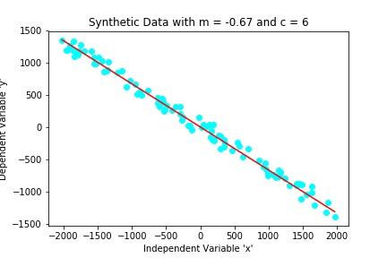
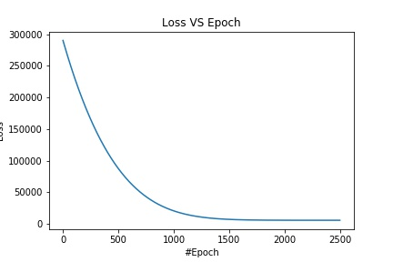
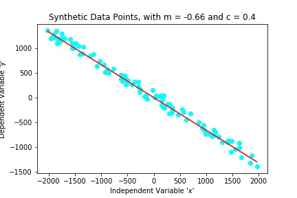
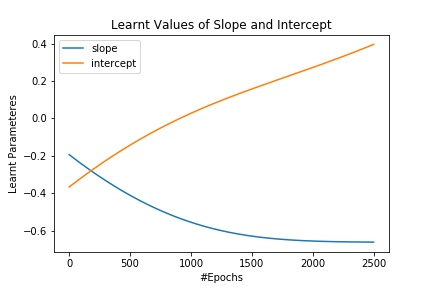

# Fitting-a-Straight-Line-on-2D-Data-in-PyTorch
Building a simple Neural Network to solve a Univariate Regression problem in PyTorch

The main focus of this repository is to showcase the flow of building and training a basic Neural Network in PyTorch.

### Step 1: Generating Synthetic 2D Data

### Step 2: Defining the Model Architecture

### Step 3: Defining a Loss Function and an Optimizer

### Step 4: Training the Model and Plotting the Loss

### Step 5: Visualizing the Straight Line Learnt by the Model

### Visualizing the Slope and the Intercept during the Training of the Model

### Important Links

Medium Blog: https://medium.com/@animesh7pointer/fitting-a-straight-line-on-2d-data-in-pytorch-78d0e3450876

Kaggle Kernel: https://www.kaggle.com/n0obcoder/fitting-a-straight-line-on-2d-data-in-pytorch
